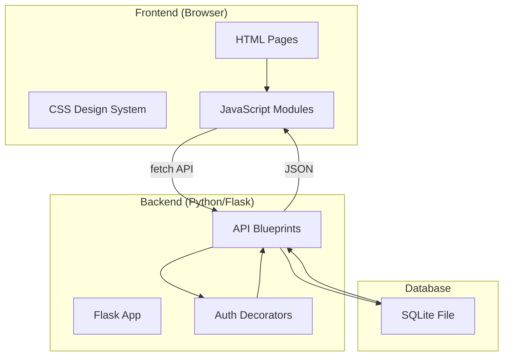

# Library Management System — Implementation Plan

## Goal

Build a complete, production-quality **Library Management System (LMS)** as a full-stack web application with a stunning, modern UI. The system will handle book inventory, member management, issue/return workflows, automated fine calculation, search, reports, and a real-time dashboard.

---

## Technology Stack

| Layer | Technology |
|---|---|
| **Frontend** | HTML5, Vanilla CSS, JavaScript (ES6+) |
| **Backend** | Python 3 + Flask |
| **Database** | SQLite (via Python `sqlite3` stdlib) — zero-config, file-based |
| **Auth** | Flask session-based with `flask-login` |
| **Password Hashing** | `werkzeug.security` |
| **Icons** | Lucide Icons (CDN) |
| **Fonts** | Inter (Google Fonts) |

> [!NOTE]
> SQLite is chosen for simplicity — no separate database server needed. Python's built-in `sqlite3` module requires zero extra dependencies for DB access.

---

## User Review Required

> [!IMPORTANT]
> **Authentication**: The plan includes an **Admin** login (librarian) and a **Member** login. Admin has full CRUD access; members can search books and view their own history. Is this acceptable, or do you want a single admin-only system?

> [!IMPORTANT]
> **Fine Rate**: The plan uses **₹2 per day** overdue fine with a **14-day** loan period. Please confirm or provide your preferred values.

> [!IMPORTANT]
> **Design Theme**: Planning a **dark-mode-first** theme with glassmorphism cards, gradient accents (indigo → violet), and smooth micro-animations. Let me know if you prefer a different aesthetic.

---

## Proposed Changes

### Database Layer

#### [NEW] `database/schema.sql`
SQL schema defining three core tables matching your specification:
- **Books** — `BookID`, `Title`, `Author`, `Publisher`, `Category`, `Quantity`, `IssuedCount`, `AddedDate`
- **Members** — `MemberID`, `Name`, `Email`, `Phone`, `MembershipType`, `JoinDate`, `ExpiryDate`, `BooksIssuedCount`, `PasswordHash`
- **Transactions** — `TransactionID`, `MemberID`, `BookID`, `IssueDate`, `DueDate`, `ReturnDate`, `Fine`, `Status`

#### [NEW] `database/seed.py`
Seeds the database with sample books and a default admin account for demonstration.

#### [NEW] `database/db.py`
Database connection helper using Python's built-in `sqlite3`, auto-creates tables on first run.

---

### Backend API (Express.js)

#### [NEW] `app.py`
Main Flask application — registers all blueprints, serves static files, configures sessions.

#### [NEW] `routes/auth.py`
Flask Blueprint for authentication:
- `POST /api/auth/login` — Authenticate admin/member
- `POST /api/auth/register` — Register new member
- `POST /api/auth/logout` — Destroy session
- `GET /api/auth/me` — Get current user info

#### [NEW] `routes/books.py`
Flask Blueprint for book CRUD:
- `GET /api/books` — List all books (with search/filter query params)
- `GET /api/books/<id>` — Get single book details
- `POST /api/books` — Add new book (admin only)
- `PUT /api/books/<id>` — Update book (admin only)
- `DELETE /api/books/<id>` — Delete book (admin only)

#### [NEW] `routes/members.py`
Flask Blueprint for member management:
- `GET /api/members` — List all members (admin only)
- `GET /api/members/<id>` — Get member details
- `PUT /api/members/<id>` — Update member (admin only)
- `DELETE /api/members/<id>` — Remove member (admin only)

#### [NEW] `routes/transactions.py`
Flask Blueprint for issue/return:
- `POST /api/transactions/issue` — Issue a book (admin only)
- `POST /api/transactions/return` — Return a book (admin only)
- `GET /api/transactions` — List all transactions (admin: all, member: own)
- `GET /api/transactions/overdue` — Get overdue books

#### [NEW] `routes/reports.py`
Flask Blueprint for reports:
- `GET /api/reports/dashboard` — Dashboard stats (total books, members, issued, overdue)
- `GET /api/reports/issued` — Currently issued books report
- `GET /api/reports/overdue` — Overdue books report
- `GET /api/reports/activity` — Member activity report

#### [NEW] `middleware/auth.py`
Python decorators — `login_required`, `admin_required` guards.

---

### Frontend (Static Files)

#### [NEW] `public/index.html`
Login / landing page with animated gradient background, glassmorphism login card.

#### [NEW] `public/dashboard.html`
Admin dashboard with:
- Stats cards (total books, members, issued today, overdue)
- Recent transactions table
- Quick-action buttons (Issue Book, Return Book, Add Book)
- Charts (optional, using Chart.js)

#### [NEW] `public/books.html`
Book catalog page:
- Search bar with real-time filtering (by title, author, category)
- Card/table view toggle
- Add/Edit/Delete book modals (admin)
- Availability badges

#### [NEW] `public/members.html`
Member management page:
- Member list with search
- Add/Edit/Delete member modals
- Member profile cards showing books issued

#### [NEW] `public/transactions.html`
Transaction management:
- Issue Book form (select member + book)
- Return Book form with auto-fine calculation
- Transaction history table with filters

#### [NEW] `public/reports.html`
Reports page:
- Issued books report
- Overdue books report
- Member activity report
- Export to CSV functionality

#### [NEW] `public/css/style.css`
Complete design system:
- CSS custom properties (colors, spacing, typography, shadows)
- Dark mode theme with glassmorphism
- Gradient accents (indigo-to-violet)
- Responsive grid layouts
- Card, button, input, table, modal, badge, toast component styles
- Smooth transitions and micro-animations (hover lifts, fade-ins, pulse effects)

#### [NEW] `public/js/app.js`
Core application module:
- API client (fetch wrapper with error handling)
- Auth state management
- Navigation/routing between pages
- Toast notification system
- Modal management
- Utility functions (date formatting, currency formatting)

#### [NEW] `public/js/dashboard.js`
Dashboard page logic — fetch stats, render cards, recent transactions.

#### [NEW] `public/js/books.js`
Books page logic — CRUD operations, search, filtering.

#### [NEW] `public/js/members.js`
Members page logic — CRUD operations, search.

#### [NEW] `public/js/transactions.js`
Transactions page logic — issue/return workflows, fine calculation display.

#### [NEW] `public/js/reports.js`
Reports page logic — fetch and render reports, CSV export.

---

### Configuration

#### [NEW] `requirements.txt`
Python dependencies:
- `flask`, `flask-login`, `flask-cors`, `werkzeug`

---

## Architecture Diagram

---

## Design Preview

### Color Palette
| Token | Value | Usage |
|---|---|---|
| `--bg-primary` | `#0f0f23` | Main background |
| `--bg-card` | `rgba(255,255,255,0.05)` | Glassmorphism cards |
| `--accent-1` | `#6366f1` | Indigo primary |
| `--accent-2` | `#8b5cf6` | Violet secondary |
| `--accent-gradient` | `linear-gradient(135deg, #6366f1, #8b5cf6)` | Buttons, highlights |
| `--success` | `#22c55e` | Available, returned |
| `--warning` | `#f59e0b` | Due soon |
| `--danger` | `#ef4444` | Overdue, errors |
| `--text-primary` | `#f1f5f9` | Main text |
| `--text-secondary` | `#94a3b8` | Muted text |

### Typography
- **Font**: Inter (Google Fonts)
- **Headings**: 600–700 weight, letter-spacing -0.02em
- **Body**: 400 weight, 1.6 line-height

### Key Visual Features
- Glassmorphism cards with `backdrop-filter: blur(12px)`
- Gradient borders on focus/hover
- Smooth 300ms transitions on all interactive elements
- Animated stat counters on dashboard
- Floating labels on form inputs
- Pulsing dot indicators for live status

---

## Open Questions

> [!IMPORTANT]
> 1. **Admin vs. Multi-role**: Should members have their own portal to search books and view their history, or is this admin-only?
> 2. **Fine Rate**: ₹2/day with 14-day loan period — acceptable?
> 3. **Notification System**: Should the system show in-app notifications for overdue books, or is a report page sufficient?

---

## Verification Plan

### Automated Tests
1. Start the server with `python app.py`
2. Use browser subagent to:
   - Navigate to login page and verify UI renders
   - Log in as admin
   - Add a new book and verify it appears in the catalog
   - Register a new member
   - Issue a book and verify quantity decreases
   - Return a book and verify quantity increases
   - Check dashboard stats update correctly
   - Test search functionality
   - Verify responsive layout at mobile breakpoints

### Manual Verification
- Visual inspection of all pages for design quality
- Test all CRUD operations end-to-end
- Verify fine calculation logic with overdue scenarios
